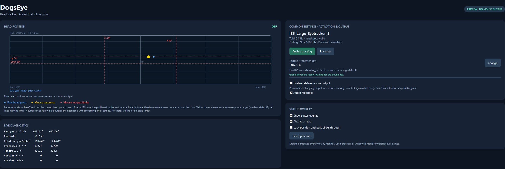
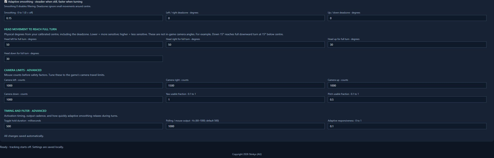
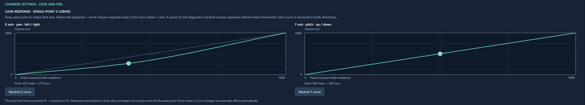

# DogsEye user guide

[Back to README](../README.md)

## 1. Starting and stopping

Run `DogsEye.exe` with its accompanying files. The self-contained distribution does not require the .NET SDK or Visual Studio; Tobii device software is still required.

DogsEye starts with tracking off and Windows mouse output disabled. It can still read head pose and preview the response while off.

| Action | Effect |
| --- | --- |
| Enable tracking | Collects a short set of valid samples to calibrate centre, then activates tracking. |
| Disable tracking | Stops output without moving the camera back to centre. |
| Recenter | Uses the current fresh pose as zero and resets response without corrective mouse input. Works while off. |
| Short press of the bound key | Recenter. |
| Long press of the bound key | Toggle tracking once; releasing does not also recenter. |
| Change | Capture a new activation key. Escape cancels. |
| Enable relative mouse output | Select live output; changing this mode stops tracking, so enable tracking again when ready. |

The default binding is backtick (`Oem3`), held for three seconds to toggle. The binding is received globally through Windows Raw Input. It is not suppressed in other applications, so choose a key that does not conflict with the game.

Recenter requires a fresh valid pose. If the tracker cannot see you, restore tracking before recentering. Activation performs a fresh calibration even if you recentered while off.

## 2. Reading the head-position visual

| Element | Meaning |
| --- | --- |
| Blue dot | Unfiltered SDK head movement relative to the latest centre. |
| Yellow dot | Processed mouse-response target, including a preview while off. It is not the Windows cursor position. |
| Shaded centre area | Deadzone: movement here produces a zero response target. |
| Red dotted lines | Head angles at which the corresponding mouse-response target reaches its limit. |
| Zero crosshair | The centre established by calibration or recentering. |
| SDK angle readout | Absolute raw yaw/pitch reported by Tobii, before subtracting centre. |

The axes are fixed at ±180°. Moving your head does not zoom or pan the plot. All supported head-range limits fit inside it. Recenter puts both dots at zero without changing the scale. The blue dot can continue beyond a red limit; yellow clamps at that response limit. Filtering and output interpolation may still finish settling after a limit is reached.

A neutral curve makes yellow follow blue outside the deadzone, within the limits, when smoothing is off or has settled. They can differ while smoothing, inside the deadzone, beyond a reach limit, or with a shaped curve.

Stale samples are dimmed and labelled. Actual virtual output counts and emitted deltas are shown in **Live diagnostics**. The yellow marker shows a target, not proof that Windows or a game accepted every requested movement.

## 3. Automatic saving

Valid numeric edits, curve changes, and adaptive-smoothing changes save after a **300 ms pause**. Leaving a numeric field also saves pending edits. Valid tuning changes take effect without stopping tracking or losing the centre.

Incomplete or invalid input leaves the last valid configuration active and displays a message. Correct the field to save the edited group. Output-mode changes and activation-key rebinding still stop tracking.

Settings are stored in `%LOCALAPPDATA%\DogsEye\settings.json`. State/error logs are in the same folder. The live-output checkbox and active tracking state are not restored on startup.

## 4. Tuning settings

*The screenshot shows custom saved tuning, including 1000 Hz. New settings use 500 Hz; saved values are preserved.*

### Head movement to reach full turn

These are physical angles from the calibrated centre, **including the deadzone**. They are not in-game camera angles.

| Setting | Default | Unit |
| --- | --- | --- |
| Head left / right | 30 / 30 | Degrees from centre |
| Head up / down | 20 / 20 | Degrees from centre |
| Yaw deadzone | 2.5 | Degrees on either side of centre |
| Pitch deadzone | 2 | Degrees on either side of centre |

Head ranges must exceed the corresponding deadzone and cannot exceed 90°. Lowering a range increases sensitivity: less head movement reaches full output. Increasing it makes reaching that same output take more head movement.

For example, with a 2° pitch deadzone, a 10° downward tilt uses:

- `(10 − 2) / (20 − 2) = 44.4%` of a 20° head-down range.
- `(10 − 2) / (90 − 2) = 9.1%` of a 90° head-down range.

The curve then transforms that fraction. Tobii reports positive pitch looking up and negative pitch looking down.

### Mouse-count limits

| Setting | Default |
| --- | --- |
| Camera left / right | 3000 / 3000 counts |
| Camera up / down | 1700 / 1500 counts |
| Yaw usable fraction | 0.92 |
| Pitch usable fraction | 0.90 |

Counts can be 1–50000; usable fractions can be 0.1–1. These defaults are starting examples, not measured limits for a particular game.

Maximum target magnitude is `camera counts × usable fraction`. The game’s sensitivity and input handling determine how far its camera turns. Windows pointer settings can affect desktop cursor travel. DogsEye does not confine the cursor to a monitor.

**If the cursor or camera travels too far, reduce the appropriate Camera counts value.** Changing the head range changes sensitivity, not maximum count travel.

Example: Head down 20°, pitch deadzone 0°, curve point at 25% head / 36% turn, Camera down 1500, and pitch fraction 0.90 produces a settled target of `1500 × 0.90 × 0.36 = 486` downward counts at just 5° head tilt. At 20°, the target is 1350 counts. Counts are not guaranteed to equal desktop pixels.

### X and Y response curves

*The X example uses 42% head / 27% turn for gentler early response. Y is neutral at 50% / 50%. These are example saved settings.*

X controls yaw/left-right; Y controls pitch/up-down. Each graph has one draggable point. Its horizontal coordinate is usable head movement after the deadzone; its vertical coordinate is the fraction of mouse travel.

- Point on the diagonal: neutral, linear response.
- Point above the diagonal: greater mouse response early in the turn.
- Point below the diagonal: smaller early response.
- Move the point left: reach its output percentage with less head movement.
- Move it right: require more head movement for that percentage.

A point at 20% head / 50% turn gives half the configured mouse travel at one fifth of the usable head range. Curves apply symmetrically to both signs of their axis; directional head/count limits remain independent.

Drag the point or focus the graph and use arrow keys for 1% steps; Shift + arrows uses 5%. **Home**, **Neutral X curve**, and **Neutral Y curve** restore 50%/50%. Control points are restricted to 10–90% in each coordinate. The endpoints remain zero and full output.

### Smoothing

**Smoothing** defaults to 0.15, from 0 to 1. Zero bypasses filtering. Higher strength steadies small movement but can add lag.

**Adaptive smoothing** defaults on. It filters more when nearly still and responds faster during deliberate turns. **Adaptive responsiveness** defaults to 0.1, from 0 to 1; higher values relax filtering more during movement. Uncheck adaptive smoothing to use the fixed filter.

### Timing and polling

**Toggle hold duration** defaults to 3000 ms and accepts 500–10000 ms.

**Polling / mouse output** accepts 60–1000 Hz, default 500 Hz. At 500 Hz the requested interval is 2 ms; at 1000 Hz it is 1 ms. Existing saved rates remain unchanged.

A higher output cadence does not increase the Tobii sensor’s sample rate or total mouse travel. The status panel separates fresh Tobii samples, worker polling ticks, and nonzero mouse/preview events per second. Actual scheduling depends on the system.

## 5. Suggested tuning order

1. Use preview mode, face a comfortable direction, and recenter.
2. Start with neutral curves and choose comfortable physical head ranges.
3. Set deadzones to ignore unwanted small movement near centre.
4. Tune Camera counts to the desired total travel at the game’s current sensitivity.
5. Adjust each response curve for early-turn sensitivity.
6. Adjust smoothing to balance steadiness and lag.
7. Enable live mouse output and activate tracking when ready to test. Recenter after manual view adjustments as needed.

Holding a stable head position should settle at a bounded target, not keep turning forever. Returning to centre moves the target back towards zero. Recenter treats the current game view as the new logical centre; it does not send a return-to-centre movement.

## 6. Status overlay

| Label | Meaning |
| --- | --- |
| OFF | Tracking disabled; no live mouse movement. |
| CAL | Gathering activation calibration samples. |
| ON | Tracking active; the main window indicates whether output is live or preview. |
| LOST | Tracking session interrupted by unavailable or stale pose data. |

Use **Show status overlay**, **Always on top**, and **Lock position and pass clicks through** to configure it. Drag it while unlocked; **Reset position** restores a safe position. Placement persists across runs. Borderless/windowed games are the intended environment; exclusive-fullscreen visibility can vary.

## 7. Troubleshooting

| Symptom | Check or adjustment |
| --- | --- |
| Windows cursor reaches or crosses the display edge | Reduce Camera counts. Head degrees and red lines do not constrain cursor screen coordinates. |
| Too much response at the start | Move the curve point towards/below the diagonal, or increase physical head range. Reduce Camera counts if total travel is also excessive. |
| Yellow lags behind blue | Smoothing and output shaping can cause this. Compare with a neutral curve and smoothing 0. |
| Head movement looks small in the graph | The fixed graph covers ±180°; inspect the degree readout for actual motion. |
| No mouse movement | Check valid head pose, live-output checkbox, and active state. Changing output mode stops tracking until re-enabled. |
| Recenter unavailable | A fresh valid pose is required. Reconnect the tracker or move into view. |
| Settings do not save | Check the save-status message for invalid or incomplete values; correct them. |
| Tracking lost | Check connection, Tobii software state, and head visibility. Output stops when data is invalid or becomes stale. |
| Changed key does not toggle | Check registration status and hold progress; release the key after rebinding. |
| View differs from the app’s target | Manual mouse input, sensitivity changes, game limits, or ignored input can desynchronise the estimate. Recenter. |
| App reports rejected input | Tracking is disabled. Check application privilege differences; DogsEye does not escalate privileges automatically. |

Pose data expires after 150 ms without fresh samples. The first recovered frame does not move the mouse; subsequent output catches up at a bounded rate. DogsEye does not predict missing head movement.

## Screenshot provenance

These images were captured directly from the latest existing executable, with tracking OFF. Preview mode was selected, with Windows mouse output disabled. No settings were changed and no compilation was performed. The screenshots show custom saved tuning rather than all default values. They contain the application window only, without personal paths, names, or email addresses. The current build includes the copyright footer and the cleaned-up mouse-output label. Captures are cropped to the relevant application content with the mouse pointer outside those areas.
